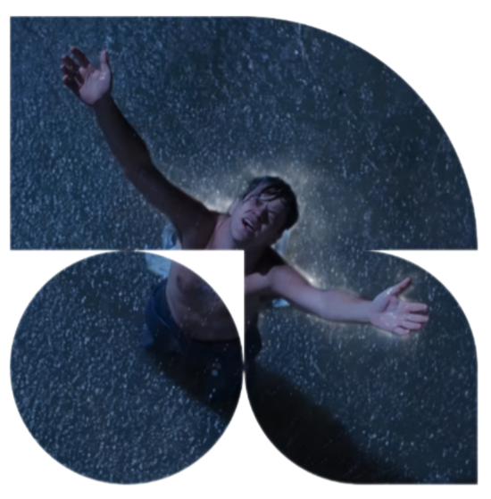
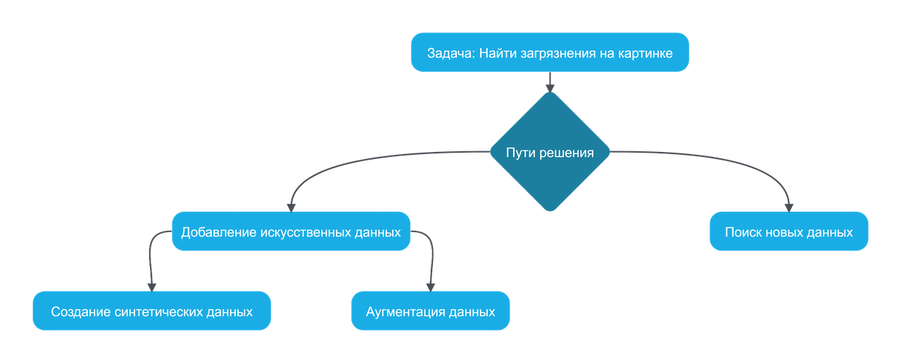
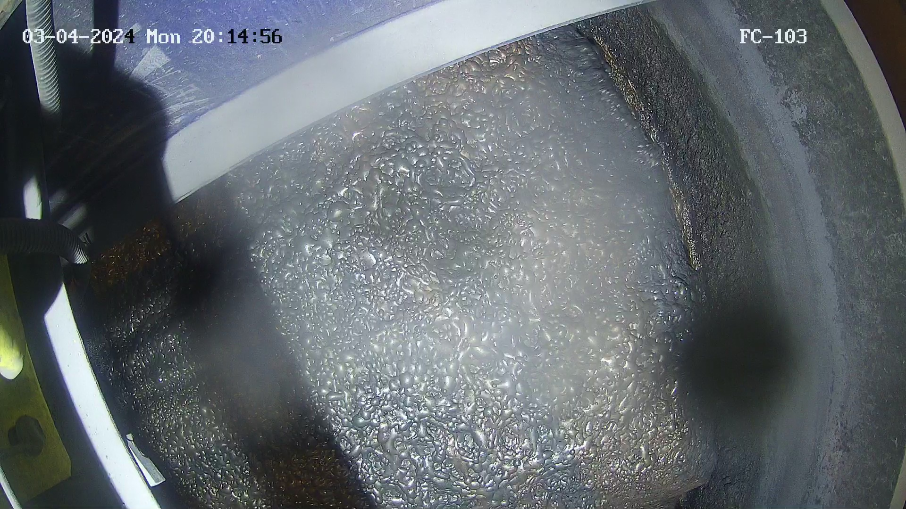
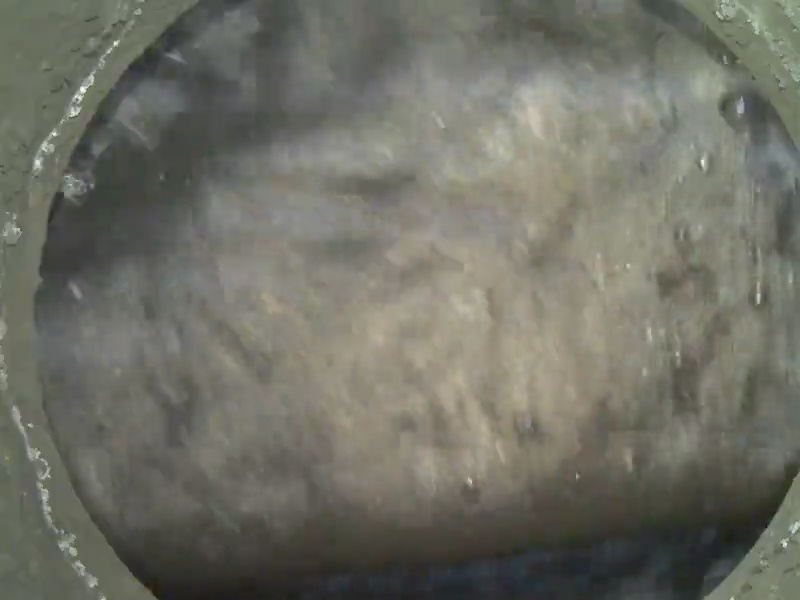
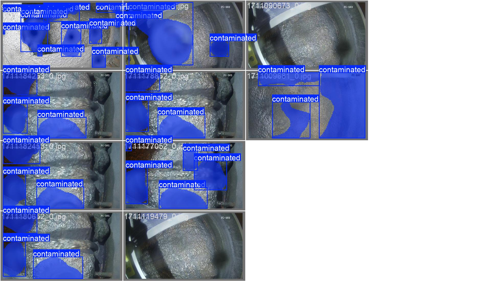
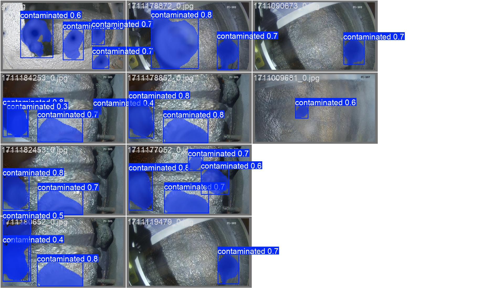

<!-- Improved compatibility of back to top link: See: https://github.com/othneildrew/Best-README-Template/pull/73 -->
<a id="readme-top"></a>


<!-- PROJECT LOGO -->
<br />
<div align="center">
  <a href="https://nornickel-hackathon.ru/">
    
  </a>

  <h3 align="center">Хакатон Норникеля</h3>

  <p align="center">
    Команда NornBruhs представляет своё решение трека "Грязные дела!
    <br />
  </p>
</div>

## Описание задумки



Начальной идеей было применение классической классификация для определения загрязнена ли картинка вообще, но мы решили уйти от этого подхода, так как он оказался не релевантным перед другими.

Дальше пройдёмся по пунктам реализации поставленной задачи:
* Анализ исходной разметки;
* Обучения модели на исходных данных;
* Обучение модели на данных с добавлением исходной синтетики;
* Обучение модели на данных с собственной синтетикой;
* Обучение модели на данных с аугментацией;
* Обучение модели на найденных данных и валидацией на наших данных;
* Использование нашего результата/Просчёт процента загрязнения камеры.

Теперь давайте посмотрим подробнее на реализацию всего этого.

<p align="right">(<a href="#readme-top">Вернуться в начало</a>)</p>

## Анализ исходной разметки

У всех возникало множество вопросов о разметке на данных нам данных (как различать камера загрязнена или нет), поэтому чтобы точно убедиться и где-то подредактировать данные, их пришлось загрузить в CVAT, из-за чего пришлось написать код для трансформации разметки в формат json (mask_conversion.ipynb), потому что на тот момент мы не особо разобрались в данном нам коде.

Примеры, которые создавали вопросы:

 

После всё было обсуждено и вопросы отпали т.т

<p align="right">(<a href="#readme-top">Вернуться в начало</a>)</p>

<!-- GETTING STARTED -->
## Обучение модели на исходных данных

Как и все(?) в начале мы решили протестировать исходные данных и исходную модельку, после чего решили обучить её и получили достаточно хорошие результаты (0,839 на открытой выборке), на тот момент, но решили двигаться дальше


## Обучение модели на данных с добавлением исходной синтетики
Ничего хорошего из этого не вышло, она добавляла совсем немного скора, что не особо помогало

## Обучение модели на данных с собственной синтетикой

Мы попробовали сгенерировать больше синтетике с помощью предоставленного кода, но это также не дало большой апгрейд.

## Обучение модели на данных с аугментацией

Аугментация была сделана с помощью библиотеки torch, код предоставлен в файл aug_data.ipynb.

Были попробованы отражения по горизонтали и вертикали, это уже чуть улучшило результат и сработало лучше чем с синтетикой, но возможно тут уже сработало возможное переобучение ;(

## Обучение модели на найденных данных и валидацией на наших данных

Один из экспертов подсказал использовать какой-либо доп.датасет, мы не долго думая решили протестировать именно тот, что он указал, но там была проблема в том, что маски были указаны для некоторого количества классов, нас же инетерсует только один (общее загрязнение) поэтому все маски пришлось перезаписывать изменяя цвета масок на белый, чтобы была одна большая. (код предоставлен в файле conv_new_data.py) 

Обучение на таких данных не показало хорошего результата, по инетерсующей нас метрике получилось добиться результат в районе 0.30. По этому на данных момент мы решили отказаться от этого способа.

Примеры полученные в результате обучения:

 

В общих чертах у неё хорошо получается, но в каких-то условиях она сильно ошибается.

<p align="right">(<a href="#readme-top">Вернуться в начало</a>)</p>

## Использование нашего решения 

Для запуска этого решения у себя на устройстве достаточно выполнить несколько простых шагов:
1. Клонировать репозеторий к себе на устройство
    ```
    git clone https://github.com/fdorii/nornnickel_hac.git
    ```
2. Скачать требуемые библиотеки, если они не были установлены:
    ```
    numpy 
    opencv-python 
    tensorflow 
    ultralytics 
    torch 
    torchvision
    ```
3. Запустить файл, если требуется проверка решения:
    ```
    python local_pred_model.py <папка где хранятся тестовые изображения> <папка где хранятся маски к этим изображениям> best.pt submit.json
    ```
    - local_pred_model.py - файл в котором вычисляется интересующая нас метрика, она же в конца выводится в терминале
    - best.pt - веса, которые показали наилучший результат
    - submit.json - файл куда сохранятся все предсказания
4. Для визуализации решения стоит открыть файл model_inference_visualization.ipynb, там же находится вычисление процентов загрязнения


## Ссылка на данные и модели

Все данные на которых обучалась модель, а также результаты обучения храняться на гугл диске: 

- [x] Запускаемость решения
- [x] Полнота решения
- [x] Прозрачность пайплайна получения весов модели (обучения)
- [x] Техническая реализация необходимых компонентов
- [x] Реализованы дополнительные фичи, не оговоренные ранее
    - [x] Просчёт процентов и определения степени загрязнения с помощью кода

<p align="right">(<a href="#readme-top">Вернуться в начало</a>)</p>

## Заключения

Мы решили идти не сложным путём, потому что ограничения действующие на решение достаточно сильно обрезают возможность использования какого-либо другого подхода. Мы считаем что на той работе, которая была проведена, результат получился хорошим, но не лучшим. В дальнейшем его стоит дополнить более высоким качеством предсказания и возможно какими нибудь дополнительными фичами, такими как определние типа загрязнения.

<h3 align="center">Спасибо за то, что потратили время на разбор нашего решения 💙</h3>

### Команда, которая разрабатывала данное решение

[](https://github.com/fdorii) [](https://github.com/Neas1231)

<p align="right">(<a href="#readme-top">Вернуться в начало</a>)</p>
